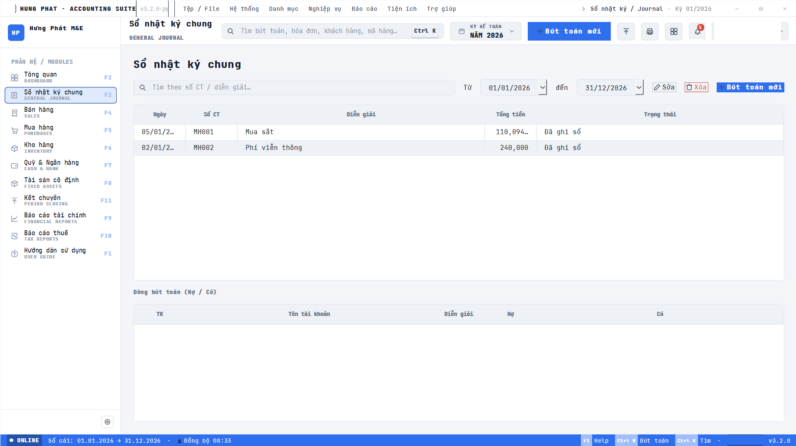
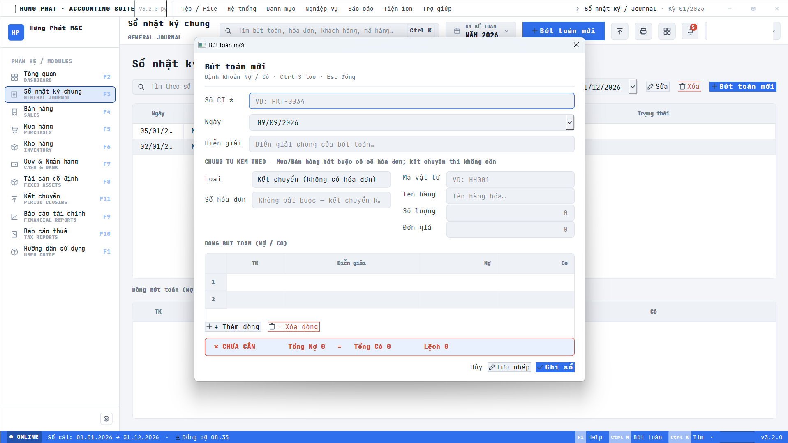
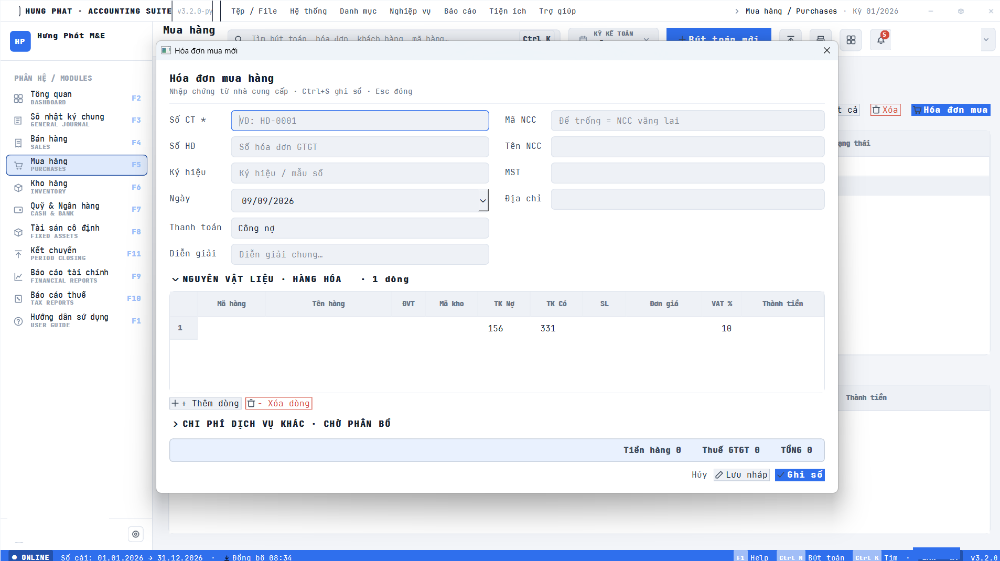
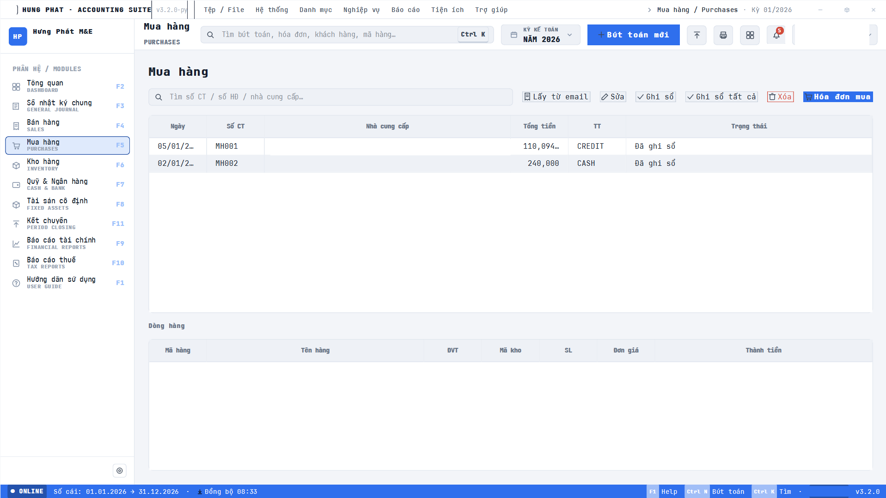
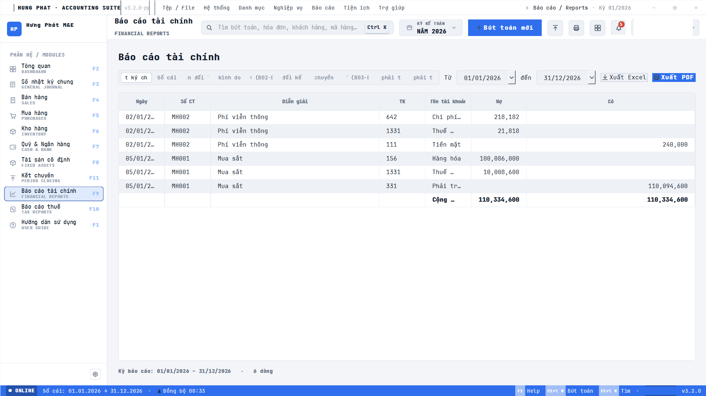
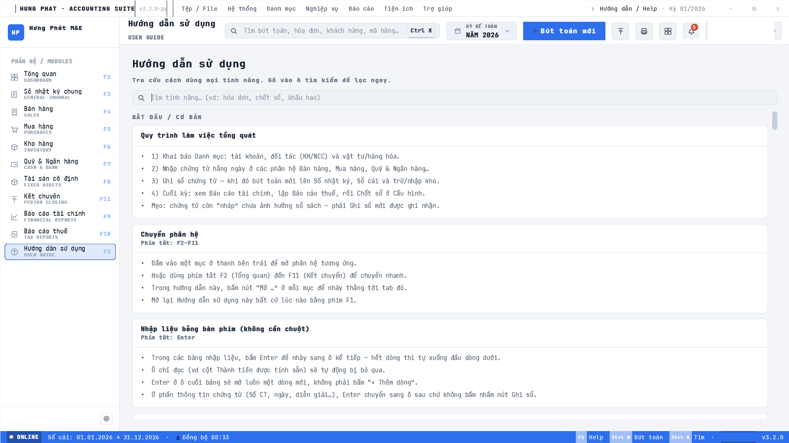

# Hưng Phát Accounting Suite

<samp>[Tiếng Việt](README.md) · **English** · [中文](README.zh.md) · [Français](README.fr.md)</samp>

A desktop accounting application for Vietnamese businesses, built with **Python + PySide6**.
It supports the **Circular 200** and **Circular 133** accounting regimes (switchable) and
stores everything locally in **SQLite** — no server required, runs entirely on the user's machine.

> In-app display name: *Hung Phat Accounting* — organization: *Hung Phat M&E*.
> Sole developer, May – August 2026. In production use at a mechanical &
> electrical contractor.

**Scale:** ~34,500 lines of Python · 33 domain services · 21 screens ·
22 schema migrations · **424 automated tests**.

---

## Why this is more than a CRUD app

Four requirements shaped nearly every design decision:

**1 · Two statutory regimes, side by side.** Vietnam operates Circular 200 and
Circular 133 simultaneously, with different charts of accounts. The application
switches between them rather than picking one.

**2 · Every document is a journal entry.** A sales invoice is not a row in a
table. It has to emit balanced journal lines *and* inventory movements, and post
provisional cost of goods sold at the moment of sale rather than deferring it to
month end.

**3 · Period-end closing is a chain, and it must be idempotent.** Work in
progress to finished goods (`154 → 155`), prepaid expense amortization (`242`),
then results carried to retained earnings (`911 → 4212`). Each step is keyed by
document number, so running it twice cannot double the books.

**4 · The books have to prove themselves.** After closing, income and expense
accounts must show a zero balance. The application checks this and reports
whatever is left standing — it deliberately does **not** silently adjust the
ledger, because that decision belongs to the accountant.
See `domain/services/zero_balance_service.py`.

---

## Screenshots

The application running on real books at a mechanical & electrical contractor.


*General journal — keyboard-first entry, F2–F11 module switching*

| | |
|---|---|
| <br>*Entry dialog — live debit/credit balance check* | <br>*Purchase invoice — auto-posts journal entries and stock movement* |
| <br>*Purchase register — invoices pulled in from email* | <br>*Financial reports — Excel and PDF export* |
| <br>*Searchable in-app user guide, written for non-technical staff* |  |

---

## Key features

| Module | Description |
|---|---|
| **Dashboard** | Overview: revenue/expenses, receivables/payables, trend charts, quick metrics. |
| **General journal** | Manual journal entries with per-line partner tagging (accounts 131/331). |
| **Directory** | Chart of accounts, customers/suppliers, items, warehouses. |
| **Sales / Purchases** | Output/input invoices that auto-generate journal entries and inventory movements. |
| **Cash** | Cash & bank receipt/payment vouchers with partner selection for receivables/payables. |
| **Inventory** | Goods received–issued–on-hand sheets for materials and **product costing** (allocated by material ratio). |
| **Fixed assets** | Fixed-asset register and depreciation. |
| **Tax** | VAT / corporate income tax returns, pre-filled with company details. |
| **Reports** | General ledger, detailed ledgers, trial balance, income statement; export to Excel/PDF. |
| **E-invoices** | Fetch invoices from email (IMAP), parse the XML into draft documents. |
| **Year-end closing** | Locks a fiscal year's data; auto-closes 48 hours after year-end if left untouched. |

### Fetching e-invoices from email

- Connects to the mailbox over **IMAP** with two authentication modes: **OAuth2 (XOAUTH2)**
  for Gmail, or **App Password / IMAP password** (Yahoo, custom IMAP).
- Parses **e-invoice XML in the TT78/Decree 123 standard** (tags `TTChung`, `NDHDon`,
  `NBan`, `NMua`, `DSHHDVu`…), compatible with most providers (Viettel, VNPT, MISA, BKAV…).
- Reads **XML compressed inside a `.zip`** too; any attached PDF is kept for reference.
- **Automatic sale/purchase classification by company tax code**: when the seller's tax code
  matches the company → **sales** invoice (partner = buyer); otherwise → **purchase**.
  - **Purchase** invoices usually land in `INBOX` (the e-invoice portal emails them to you).
  - **Sales** invoices you compose and email to customers live in `[Gmail]/Sent Mail`.
- The **"Rescan from start"** button resets the UID marker to re-scan the whole folder
  (duplicates are prevented by invoice number).

Detailed instructions are available in-app: **User Guide → "Automatically fetch e-invoices
(HĐĐT) from email"**.

---

## Requirements

- **Python ≥ 3.11**
- Windows (tested on Windows 11); should also run on any platform PySide6 supports.

## Install & run

```bash
# 1) Create a virtual environment
python -m venv .venv
# Windows:
.venv\Scripts\activate
# macOS/Linux:
# source .venv/bin/activate

# 2) Install dependencies (including the report-export extras)
pip install -e ".[reports]"

# 3) Run the app
python main.py
```

To also install the testing tools: `pip install -e ".[dev,reports]"`.

### User data

The database and attachments are stored outside the source tree, at:

```
%APPDATA%\HungPhatAccounting\
├── ketoan.db          # all accounting data (SQLite)
└── einvoices\         # invoice PDFs downloaded from email
```

On first launch the app creates the database and seeds the chart of accounts.

### Demo data & reset

Under **Settings → Demo data**:
- **Load demo data** — generates a full year of figures to try things out.
- **Wipe all data** — start entering real figures (always keeps the chart of accounts
  and the selected circular).

---

## Project structure

```
Ketoan/
├── main.py                  # Entry point (QApplication + ChromeWindow)
├── app/                     # Config, theme, email poller, shortcuts
├── domain/                  # Pure-Python business logic (UI-independent)
│   ├── models/              #   Dataclasses: Invoice, Journal, Partner, Item…
│   └── services/            #   Logic: sales/purchases, inventory, costing, tax, e-invoice…
├── data/                    # Data layer
│   ├── database.py          #   Shared SQLite connection
│   ├── migrations/          #   *.sql that create/upgrade the schema in order
│   ├── repositories/        #   Per-table queries
│   └── email/               #   IMAP client + OAuth (e-invoice fetch)
├── ui/                      # PySide6 interface
│   ├── chrome/              #   Window shell, sidebar, status bar
│   ├── screens/             #   One screen per module
│   ├── modals/ primitives/  #   Dialogs & reusable widgets
│   └── resources/           #   QSS, fonts, icons
├── reports/exporters/       # Export to Excel (openpyxl) / PDF (reportlab)
└── tests/                   # pytest (domain, data, reports, ui)
```

### Architecture

A clear layering: **UI → domain services → repositories → SQLite**. The `domain` layer
does not import PySide6, so it can be tested independently without a GUI. All SQLite work
goes through one shared connection on the main thread; network tasks (IMAP) run in a
`QThread` and hand results back to the main thread for safe DB writes.

### Engineering decisions worth a look

**The domain layer imports no GUI framework.** Not as a style preference — it is
what makes 424 tests runnable headless in seconds. Business logic never reaches
for a widget, and the UI never reaches past a service into SQL.

**Migrations are append-only.** 22 numbered `.sql` files applied in order at
startup. A released migration is never edited; a schema change gets the next
number. That is why the database on a user's machine can be upgraded without
anyone exporting and re-importing their books.

**The e-invoice parser branches on schema, because reality does.** Invoices were
expected to arrive in the current TT78 / Decree 123 format. Real ones turned out
to include the older `laphoadon.gdt.gov.vn/2014/09/invoicexml/v1` layout, still
in circulation. The parser detects which it is holding and dispatches
accordingly — see `domain/services/einvoice_parser.py`. Sale versus purchase is
then classified automatically by comparing the seller's tax code to the
company's own.

**Network work is quarantined.** IMAP and OAuth2 run on a `QThread`; results are
handed back to the main thread, which owns the single SQLite connection. The
worker never writes to the database itself.

**User data lives outside the program directory.** The database and downloaded
invoice PDFs sit in `%APPDATA%\HungPhatAccounting\`, so reinstalling or
upgrading the application cannot touch the books.

**Locking is a year-end operation, not a per-document flag.** Rather than
marking each voucher posted or unposted, a fiscal year is closed as a unit —
which is how the accountants who use this actually think about it.

**Known limitation, stated honestly:** email passwords and OAuth tokens are
base64-*obfuscated* in the `settings` table, not encrypted. On a single-user
personal machine that was the accepted trade-off; an OS keyring is the correct
fix and is out of scope for this version.

---

## Database

The schema is managed by files in `data/migrations/` (named `NNN_name.sql`), run in order
at startup. Add schema changes by creating a new migration file with the next number —
do not edit already-released files.

## Testing

```bash
python -m pytest --basetemp=.pytest_tmp
```

> ⚠️ On Windows the `--basetemp=.pytest_tmp` flag is required, otherwise tests that use a
> temp directory hit permission errors.

Tests focus on the `domain`/`data` layers (no GUI needed). E-invoice-related examples:
`tests/domain/test_einvoice_parser.py`, `tests/domain/test_invoice_import_service.py`,
`tests/domain/test_email_config_service.py`, `tests/data/test_imap_client.py`.

---

## Development notes

- **Runtime dependencies**: `PySide6`, `google-auth`, `google-auth-oauthlib`
  (see `pyproject.toml`). Optional groups: `reports` (openpyxl, reportlab),
  `dev` (pytest, pytest-qt).
- **Posting model**: locking is done via **year-end closing** rather than per-document locks.
- **Local security**: passwords/OAuth tokens are only base64-*obfuscated* in the `settings`
  table — this is a personal machine, not a real security boundary (an OS keyring is out of
  scope for now).
